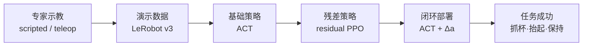

# Pick Cup Task

基于 MuJoCo 的 Unitree G1 桌面抓杯任务：专家 scripted 示教 → LeRobot 数据 → ACT 模仿学习 →（可选）residual RL 微调 → 仿真闭环评估；亦支持键盘 teleop 手动录制。

VLA（OpenPI / LeRobot π0.5）闭环评测在仓库的 `vla_sim_eval/`，**复用本目录同一套仿真内核**（场景、相机、成功判定），只做策略 I/O 适配。关系说明见 [`../vla_sim_eval/RELATIONSHIP_picktask.md`](../vla_sim_eval/RELATIONSHIP_picktask.md)。

## 端到端链路



纯 ACT 流程在 **C** 之后直接 **E → F**；`residual` 模式才走 **D**。本地仿真离线运行，**录制与训练均不需要联网**。

## 目录结构

```text
picktask/
├── readme.md
├── requirements-recording.txt   # LeRobot 录制 + ACT 训练依赖
├── requirements-rl.txt          # RL 训练依赖（可选，与 ACT 分离）
├── run_mac_pipeline.sh          # 一键 IL pipeline（转发到 scripts/）
│
├── scripts/                     # 可执行入口（从这里运行命令）
│   ├── teleop.py                # 键盘 teleop + 录制（抓杯）
│   ├── liftbag_teleop.py        # 键盘 teleop + 录制（拎包：桌杯+旁置凳包）
│   ├── pickcup_auto_demo.py     # 单次自动抓杯 + 录制
│   ├── pickcup_batch_record.py  # 批量 scripted 录制（训练集）
│   ├── pickcup_train_act.py     # ACT 训练
│   ├── pickcup_sim_eval.py      # ACT 仿真闭环评估
│   ├── pickcup_act_granular_eval.py  # ACT 多 checkpoint 分层 eval
│   ├── pickcup_train_rl.py      # PPO / residual RL 训练
│   ├── pickcup_eval_rl.py       # RL 策略评估
│   ├── check_recording_deps.py  # 依赖检查
│   └── run_mac_pipeline.sh      # IL：录制 → ACT 训练 → eval
│
├── lib/                         # 共享 Python 模块（勿直接运行）
│   ├── paths.py                 # 路径常量
│   ├── pickcup.py               # MuJoCo 场景、teleop、渲染
│   ├── liftbag.py               # 拎包场景（桌杯+旁置方凳/包）
│   ├── pickcup_sim_core.py      # scripted 控制器、成功判定
│   ├── pickcup_gym_env.py       # Gymnasium RL 环境
│   ├── pickcup_reward.py        # RL reward
│   ├── pickcup_act_inference.py # ACT 加载（residual RL 用）
│   ├── pickcup_ppo.py           # 轻量 PPO（纯 PyTorch，无需 SB3）
│   ├── lerobot_recorder.py      # LeRobot v3 写入
│   └── lerobot_video_patch.py   # torchvision 无 VideoReader 时的 PyAV 补丁
│
├── assets/
│   ├── cache/                   # G1 URDF 编译 MJCF 缓存
│   ├── reference/               # 本地 URDF 副本（运行时用 unitree_ros 官方路径）
│   ├── yellowcupassets/         # 黄杯参考图与尺寸（默认杯子变体）
│   └── img/                     # 贴图与调试截图
│       ├── textures/
│       ├── debug/
│       └── screenshots/
│
└── pickcupdata/                 # LeRobot dataset
    ├── train/                   # 批量训练集（如 pickcup_train_mac）
    ├── sessions/                # teleop / 单次 demo 录制
    └── archive/                 # 旧版 timestamp session（18 维 state 等）
```

训练好的模型保存在项目根目录 `outputs/train/act_<dataset_name>/`。

---

## 快速开始

在项目根目录（`mujoco/`）运行：

```bash
conda activate mujoco_demo
mjpython picktask/scripts/teleop.py
```

macOS 需用 `mjpython` 启动 MuJoCo Viewer；直接用 `python` 可能报 `launch_passive requires mjpython`。

只开 MuJoCo 3D Viewer：

```bash
PICKCUP_HEAD_CAMERA_PREVIEW=0 mjpython picktask/scripts/teleop.py
```

主 Viewer 内按 **Tab** 可切换到机器人 `head_camera` 视角（D435i FOV）。

同时打开 MuJoCo 3D Viewer 与机器人相机窗口：

```bash
PICKCUP_HEAD_CAMERA_PREVIEW=1 mjpython picktask/scripts/teleop.py
```

macOS 下机器人相机由当前 Conda 环境的普通 Python 子进程显示，通过共享内存接收图像；OpenCV/Qt 不再与 `mjpython` 的 GLFW/Cocoa 事件循环处于同一进程。手动关闭机器人相机窗口不会终止 3D Viewer 或录制。

若 Dock 有 `mjpython` 图标但点不开 3D 窗口，可用 `Cmd+Tab` 切到 `mjpython`。

### 自动抓杯演示（录制）

```bash
mjpython picktask/scripts/pickcup_auto_demo.py
# 无 viewer 快速跑完：
python picktask/scripts/pickcup_auto_demo.py --headless
# 显式指定杯子（默认 yellow）：
python picktask/scripts/pickcup_auto_demo.py --headless --cup yellow
python picktask/scripts/pickcup_auto_demo.py --headless --cup red
```

输出：`picktask/pickcupdata/sessions/pickcup_YYYYMMDD_HHMMSS/`。

### 拿杯 / 拎包双任务 teleop（旁置方凳+托特包）

保留桌子与杯子，在旁侧增加几何近似的黑凳与包；包体前后会在每次启动时生成不同的随机卡通印花，两条提带在顶部自然并拢。运行中按 `1` 切换到拿杯模式，按 `2` 切换到拎包模式；固定骨盆会移动到对应工位，并为不同任务分别创建数据 session。资产说明见 [`liftbagassets/README.md`](liftbagassets/README.md)。

```bash
# 同时显示 3D 与机器人视角
PICKCUP_HEAD_CAMERA_PREVIEW=1 mjpython picktask/scripts/liftbag_teleop.py
```

输出：

- 拿杯：`picktask/pickcupdata/sessions/pickcup_YYYYMMDD_HHMMSS/`
- 拎包：`picktask/liftbagdata/sessions/liftbag_YYYYMMDD_HHMMSS/`

---

## 场景说明

- 机器人：`unitree_ros/robots/g1_description/g1_23dof_mode_10.urdf`
- G1 23DOF mode_10；`pelvis` 固定，默认站在桌子**长边**外侧（`y≈-0.6224`），前脚/小腿碰撞 mesh 到桌边至少保持 15 cm 水平净空，并额外保留 3 cm 防碰裕量，绕 Z 轴 +90° 后面朝 `+Y` 正对该 1.5m 长边
- 默认布局：机器人 `x≈0.12`，杯子在桌面靠机器人一侧 `x≈0.12, y≈-0.22`
- 场景：桌子、纸杯/钢杯（可切换）、水泥地面；键盘控制腰 + 右臂 + 任务夹爪
- **杯子变体**：默认 `yellow`（闪电黄钢杯，见 `assets/yellowcupassets/`）；`--cup red` 或 `PICKCUP_CUP_VARIANT=red` 可切回红纸杯。视觉为光滑截锥 mesh，碰撞仍用隐藏圆柱分段（`cup_*` geom 名不变）
- 批量录制会对机器人 / 杯子位置做小范围随机化（见 `lib/pickcup.py` 中 `ROBOT_*_RANGE`、`CUP_*_RANGE`）
- MJCF 缓存：`picktask/assets/cache/g1_23dof_mode_10_compiled_cache.xml`（删后可重建）；杯视觉 mesh：`picktask/assets/cache/cup_meshes/`

## 成功标准

批量录制、ACT eval、RL eval **共用**同一套判定（`lib/pickcup_sim_core.py` → `check_episode_success`）：

| 条件 | 阈值 |
|------|------|
| 抓取姿态 | 右臂**手心朝杯**，指间有效接触，手腕未过度扭转 |
| 抬起高度 | 相对 episode 初始高度 **> 5 cm** |
| 保持时间 | 抬起后在 hold 阶段累计 **≥ 1.5 s** 维持合理抓取 |
| 终态 | episode 结束时仍通过 `can_initiate_grasp` |

抓取几何判定见 `lib/pickcup.py`（`can_initiate_grasp` / `can_maintain_grasp`），主要阈值：`GRASP_MIN_APPROACH_DOT=0.55`、有效指间接触、`|wrist_roll| ≤ 0.70` 等。未达标 episode **直接丢弃**，不写入训练集。

### Scripted 状态机（`AutoPickController`）

```text
SETTLE → APPROACH → ALIGN → CLOSE → LIFT → HOLD → DONE
```

- **APPROACH**：离散 `REACH_FORWARD/DOWN` 步进 + 按场景几何规划步数，避免插值轨迹碰杯
- **ALIGN**：闭合前根据夹爪-杯子几何做小步修正
- **LIFT**：`REACH_UP` 抬起；仅在 `can_maintain_grasp` 为真时继续加步
- 批量录制对每个随机场景先试跑 **4 种 approach variant**（无视频），成功后再正式录制

## 键盘控制

先点击 MuJoCo Viewer 获得焦点。`head_camera (RGB)` 第二预览窗默认关闭，可通过 `PICKCUP_HEAD_CAMERA_PREVIEW=1` 开启。

| 按键 | 功能 |
|------|------|
| 1（双任务场景） | 切换到拿杯模式，并将机器人移动到桌边 |
| 2（双任务场景） | 切换到拎包模式，并将机器人移动到凳子旁 |
| 空格 | 暂停 / 继续（暂停时不录制） |
| R / Backspace | 重置场景，保存 episode 并开新 session |
| W/S | 腰旋转 |
| Q/E | 右臂朝杯子靠近 / 远离（肩 roll/pitch/yaw + 肘联动） |
| ↑/↓ | 抬起 / 下压 |
| A/D | 肩 roll 展收 |
| Z/X | 肩 yaw 旋转 |
| C/V | 肘弯曲 / 伸直 |
| T/G | 肩 pitch 微调 |
| F/H | 张开 / 闭合夹爪 |
| ESC | 关闭 Viewer |

抓取建议：启动后手已在杯子附近（约 6cm）。`Q` 1–2 次靠近 → `↓` 轻微下压 → `H` 闭合夹爪（需手心朝向杯子）→ `↑` 抬起。若手臂贴桌被挡住，可先 `E` 略后退再微调。

---

## 数据格式（LeRobot v3）

| 字段 | 说明 |
|------|------|
| `observation.images.head_camera` | 640×480 RGB，30fps mp4 |
| `observation.state` | **8 维 proprio**（腰 + 右臂 + 夹爪，**不含杯子位姿**） |
| `action` | 8 维关节目标 |
| `task` | `"pick up the cup"` |

**存放位置：**

| 用途 | 路径 |
|------|------|
| 训练集（批量 scripted） | `pickcupdata/train/<name>/` |
| teleop / 单次 demo | `pickcupdata/sessions/pickcup_YYYYMMDD_HHMMSS/` |
| 旧实验归档 | `pickcupdata/archive/` |

**推荐训练集：**

| 数据集 | 说明 |
|--------|------|
| `pickcupdata/train/pickcup_train_200/` | 当前主训练集（200 条成功 episode，随机场景 + 严格成功标准） |
| `pickcupdata/train/pickcup_train_mac/` | 早期 smoke（8 条），仅用于跑通 pipeline |
| `pickcupdata/archive/` | 18 维 state 旧数据，**勿与当前 8 维 proprio 混训** |

### 依赖安装

```bash
conda activate mujoco_demo
python picktask/scripts/check_recording_deps.py
```

```bash
pip install -r picktask/requirements-recording.txt
# 或 macOS 推荐：
conda install -c pytorch -c conda-forge \
  "numpy>=2.0,<2.3" pytorch torchvision pyarrow opencv av datasets
```

**常见错误：**

| 现象 | 处理 |
|------|------|
| NumPy 2.x 与旧 torch 冲突 | 升级 torch≥2.7、torchvision≥0.22，numpy 2.0–2.2 |
| `libmkl_intel_lp64.2.dylib` | 卸载 pip torch，改用 conda 安装 pytorch |
| `VideoReader` 缺失 | 训练脚本已 PyAV 补丁；确保 `av` 已装 |
| OpenCV GUI 冲突 | 预览可能禁用，录制不受影响 |

本地 `lerobot/` 源码在项目根目录，训练脚本会自动加入 `PYTHONPATH`。

---

## IL Pipeline（Mac / ACT）

**一键：**

```bash
conda activate mujoco_demo
export PYTHONPATH="$(pwd)/lerobot/src:$PYTHONPATH"
bash picktask/run_mac_pipeline.sh
```

默认：8 条 demo → `pickcupdata/train/pickcup_train_mac/` → MPS 训练 2000 step → eval 3 次（**仅 smoke**）。

```bash
EPISODES=20 TRAIN_STEPS=10000 bash picktask/run_mac_pipeline.sh
```

**分步（正式训练推荐）：**

```bash
# 1. 批量录制（严格成功标准下 scripted 通过率约 10–15%，建议 max-attempts ≥ episodes×15）
python picktask/scripts/pickcup_batch_record.py \
  --episodes 200 --max-attempts 3000 --output pickcup_train_200 --seed 42

# smoke（3 条快速验证）
python picktask/scripts/pickcup_batch_record.py \
  --episodes 3 --max-attempts 30 --output pickcup_train_smoke --seed 42

# 2. ACT 训练（200 条示例）
export PYTHONPATH="$(pwd)/lerobot/src:$PYTHONPATH"
python picktask/scripts/pickcup_train_act.py \
  --dataset picktask/pickcupdata/train/pickcup_train_200 \
  --repo-id local/pickcup_train_200 \
  --output outputs/train/act_pickcup_train_200 \
  --steps 80000 --device cpu --batch-size 2 --save-freq 5000

# 从 30000 step checkpoint 继续训到 80000 step
python picktask/scripts/pickcup_train_act.py \
  --dataset picktask/pickcupdata/train/pickcup_train_200 \
  --repo-id local/pickcup_train_200 \
  --output outputs/train/act_pickcup_train_200 \
  --resume-policy outputs/train/act_pickcup_train_200/checkpoints/step_030000 \
  --steps 80000 --device cpu --batch-size 2 --save-freq 10000

# 中途 checkpoint 评估（例如 20000 step）
python picktask/scripts/pickcup_sim_eval.py \
  --policy outputs/train/act_pickcup_train_200/checkpoints/step_020000 \
  --dataset picktask/pickcupdata/train/pickcup_train_200 \
  --episodes 10 --device cpu

# 实时看 head_camera（策略视角，OpenCV 窗口）
python picktask/scripts/pickcup_sim_eval.py \
  --policy outputs/train/act_pickcup_train_200/checkpoints/step_080000 \
  --dataset picktask/pickcupdata/train/pickcup_train_200 \
  --episodes 5 --device auto --render

# 实时看 MuJoCo 3D（macOS 需 mjpython）
mjpython picktask/scripts/pickcup_sim_eval.py \
  --policy outputs/train/act_pickcup_train_200/checkpoints/step_080000 \
  --dataset picktask/pickcupdata/train/pickcup_train_200 \
  --episodes 5 --device auto --viewer

# 3D + 相机画面一起看
mjpython picktask/scripts/pickcup_sim_eval.py \
  --policy outputs/train/act_pickcup_train_200/checkpoints/step_080000 \
  --dataset picktask/pickcupdata/train/pickcup_train_200 \
  --episodes 5 --device auto --viewer --render
```

默认评估会优先读取 `picktask/pickcup_train_200.log` 中的 **scripted 成功场景**，更接近训练数据分布；若要评估原始随机场景，可加 `--scene-source random`。默认 `--max-steps 3000`，约 6 秒，接近训练 demo 平均时长。开 `--render` / `--viewer` 时默认按仿真时钟播放；若只想尽快跑完可加 `--no-realtime`。

### 批量录制说明

严格成功标准下 scripted **通过率约 10–15%**（随机场景）。200 条成功 episode 通常需 **1300–2000 次**尝试、wall-clock **约 6–12 小时**（含视频编码）。

**参数：**

| 参数 | 默认 | 说明 |
|------|------|------|
| `--episodes` | 20 | 目标**成功**条数（非尝试次数） |
| `--max-attempts` | `episodes×15` | 上限，防止无限循环 |
| `--output` | `pickcup_train` | 输出目录名（位于 `pickcupdata/train/`） |
| `--seed` | 42 | 场景随机种子 |

**监控进度：**

```bash
pgrep -fl pickcup_batch_record
grep -E '^\[.*\] (OK|FAIL)|完成:' picktask/pickcup_train_200.log | tail -5
python3 -c "import json; d=json.load(open('picktask/pickcupdata/train/pickcup_train_200/meta/info.json')); print(d['total_episodes'], 'episodes')"
```

**运行环境：**

- **不需要联网**；数据写本地磁盘
- **合盖 / 睡眠会暂停任务**；长时间录制请开盖插电，或 `caffeinate -dims -w <PID>` 防睡眠
- 日志中 FAIL 远多于 OK 属正常现象

**录制意外中断：**

| 情况 | 处理 |
|------|------|
| 已 `episode saved` 的 | **保留**，在 `pickcupdata/train/<output>/` |
| 正在录未 save 的 | 丢失 |
| 未 `finalize` 的 dataset | 已 save 的 episode 通常仍可训练 |

**续录剩余条数**（勿复用已存在的 `--output` 名）：

```bash
python picktask/scripts/pickcup_batch_record.py \
  --episodes 150 --max-attempts 2250 \
  --output pickcup_train_200_part2 --seed 43
```

当前脚本**不支持** `--resume` 向同一目录断点续写。

训练额外依赖（若报 diffusers / torch.xpu 错误）：

```bash
python -m pip install 'diffusers>=0.27.2,<0.32.0' accelerate einops draccus termcolor
```

训练好的模型：

- ACT：`outputs/train/act_<dataset_name>/`
- RL：`outputs/rl/ppo_pickcup/`（含 `ppo_pickcup_final.pt`）

### ACT 模型规格（`pickcup_train_200` / step_080000）

以当前主训练 checkpoint `outputs/train/act_pickcup_train_200/checkpoints/step_080000/` 为例：

**架构与 I/O**

| 项 | 值 |
|----|-----|
| 策略类型 | LeRobot ACT（ResNet18 + Transformer） |
| 图像输入 | `observation.images.head_camera`，640×480 RGB |
| 状态输入 | 8 维 proprio（腰 + 右臂 + 夹爪，**不含杯子位姿**） |
| 动作输出 | 8 维关节目标；`chunk_size=100`，`n_action_steps=100`（约 3.3s 开环） |
| Transformer | `dim_model=512`，encoder 4 层，decoder 1 层，VAE encoder 4 层 |

**参数量与磁盘**

| 项 | 值 |
|----|-----|
| 总参数量 | **~51.7M**（5160 万） |
| ResNet18 backbone | ~11.5M |
| ACT encoder | ~17.3M |
| VAE encoder（训练用，推理权重仍加载） | ~17.3M |
| ACT decoder | ~5.4M |
| 权重文件 `model.safetensors` | **~197 MB** |
| checkpoint 目录合计 | **~197 MB**（pre/postprocessor 可忽略） |

**内存与推理**

| 场景 | 峰值内存 / 延迟 |
|------|----------------|
| 仅加载权重 | ~200 MB（float32 parameters） |
| 单次 forward 激活 | 再 +100–300 MB |
| 闭环 eval（MuJoCo + 640×480 渲染 + ACT） | 峰值约 **1.1–1.2 GB** |
| CPU 闭环（含渲染+物理+推理） | ~**50–65 ms/控制步**（30Hz 偏紧） |
| MPS / CUDA（仅 ACT 推理） | 通常 **15–30 ms/步**，更易满足 30Hz |

macOS 上须先 `import torch` 再 `import numpy`，且须先 `ACTPolicy.from_pretrained` 再 import `mujoco` / `LeRobotDatasetMetadata` / `gymnasium`，否则可能 segfault（`pickcup_sim_eval.py`、residual 的 `pickcup_train_rl.py` / `pickcup_eval_rl.py` 已按此顺序处理）。

**评估记录：** 细粒度分层 eval 与 80k 结论见 `picktask/act_granular_eval_30ep_notes.md`；原始 per-episode 数据见 `picktask/outputs/act_granular_eval_30ep.json`。

---

## RL Pipeline（PPO / Residual RL）

RL 模块与 ACT **完全独立**：不修改 `run_mac_pipeline.sh` 与 `pickcup_train_act.py`。

实现为 **纯 PyTorch PPO**（`lib/pickcup_ppo.py`），**不需要 stable-baselines3**，避免 Mac 上 pip SSL 问题。只需已有 `torch` + `gymnasium`。

PPO 使用 Tanh-Gaussian 有界策略，并带有 KL early stop、ratio/NaN 防护和观测裁剪；如果日志中 `kl` 持续接近或超过 `0.01`，建议继续降低 `--lr`。

| 模式 | 说明 |
|------|------|
| `ppo` | 纯 proprio + 关节 delta，PPO 从零探索 |
| `residual` | residual-v2：`a = a_ACT + Δa`（小残差、夹爪锁死、hold 友好 reward） |

观测：`ppo` 为 8 维 proprio；`residual` 为 **12 维**（proprio + gripper/contact/lift/grasp）。动作：8 维 `[-1,1]` delta。

### residual-v2 相对旧版的改动

- 残差 scale：`DEFAULT×0.1`，夹爪两维 **0**
- PPO：`log_std_init=-2.5`，`ent_coef=0.001`，policy head 零初始化
- Reward：降低 lift shaping，加大 action 惩罚，增加 grasp_lost / hold_break / hold shaping
- 默认短训：**3 万** step，每 **2k** eval

> 旧目录 `outputs/rl/residual_act_80k`（obs=8、大残差）与 v2 **不兼容**，请用新输出目录重训。

### 安装 RL 依赖

```bash
# gymnasium 一般已安装；若缺失：
pip install -r picktask/requirements-rl.txt
```

pip SSL 报错（`SSLEOFError` / `Could not fetch URL https://pypi.org`）时，用国内镜像：

```bash
pip install -i https://pypi.tuna.tsinghua.edu.cn/simple gymnasium
```

`residual` 模式还需 lerobot（与 ACT 相同）：

```bash
export PYTHONPATH="$(pwd)/lerobot/src:$PYTHONPATH"
```

### 训练

```bash
# 纯 PPO（proprio，建议先跑通）
python picktask/scripts/pickcup_train_rl.py \
  --mode ppo \
  --timesteps 200000 \
  --lr 5e-5 \
  --output outputs/rl/ppo_pickcup

# Residual-v2（在 ACT 上微调；默认 30k / eval_every=2000）
export PYTHONPATH="$(pwd)/lerobot/src:$PYTHONPATH"
python picktask/scripts/pickcup_train_rl.py \
  --mode residual \
  --act-policy outputs/train/act_pickcup_train_200/checkpoints/step_080000 \
  --act-dataset picktask/pickcupdata/train/pickcup_train_200 \
  --device auto \
  --output outputs/rl/residual_act_v2
```

录取门槛：细粒度/标准成功 **不低于纯 ACT**（约 13%）再保留；掉下去就停，不要盲目加长到 10 万+。

macOS：须先 `import torch` 再 `numpy`，且 residual 须先 `ACTPolicy.from_pretrained` 再 import `mujoco`/`gymnasium`。

### 评估

```bash
python picktask/scripts/pickcup_eval_rl.py \
  --policy outputs/rl/ppo_pickcup/ppo_pickcup_final.pt \
  --mode ppo \
  --episodes 10

# residual-v2 评估需带上 ACT 路径
python picktask/scripts/pickcup_eval_rl.py \
  --policy outputs/rl/residual_act_v2/ppo_pickcup_best.pt \
  --mode residual \
  --act-policy outputs/train/act_pickcup_train_200/checkpoints/step_080000 \
  --act-dataset picktask/pickcupdata/train/pickcup_train_200 \
  --episodes 20

# 细粒度分层（对齐 ACT granular）
python picktask/scripts/pickcup_rl_granular_eval.py \
  --rl-dir outputs/rl/residual_act_v2 \
  --policies act_only,residual_best,residual_final \
  --episodes 30 \
  --output-json picktask/outputs/rl_granular_eval_v2_30ep.json
```

**推荐顺序：** 批量录制 200 条 → ACT 80k steps → ACT eval 有 baseline → 再跑 residual-v2 短训。
---

## 记录字段

**`observation.state`（8 维，ACT 输入）：** 腰、右臂 5DOF、夹爪关节角。

**`action`（8 维）：** 与 proprio 相同的 teleop / scripted 目标关节。

**`FULL_STATE`（18 维，含杯子位姿）：** 仅代码内调试用，**不写入 dataset**。

---

## 常见问题

**按键无反应：** 先点击 Viewer 窗口；看终端是否打印 `>>> joint_name: value rad`。

**macOS `TSM AdjustCapsLockLED`：** 可忽略。

**`mj_contactParam: Invalid condim value`：** 重启 → 删 `assets/cache/g1_23dof_mode_10_compiled_cache.xml` → 小幅移动关节。

**sessions 目录很多：** teleop 每次启动/重置会新建 session，属正常；训练请用 `pickcupdata/train/` 下的合并 dataset。

**批量录制很慢 / FAIL 很多：** 严格成功标准下约 10–15% 通过率；每条成功含试跑 + 640×480 视频编码。先跑 `--episodes 3` smoke 确认 pipeline 正常。

**录制中断：** 已 save 的 episode 保留；用新 `--output` 名补录剩余条数，见上文「批量录制说明」。

**合盖后进度不动：** macOS 睡眠会挂起进程；开盖唤醒或 `caffeinate` 防睡眠。

## 当前限制

- 无完整 G1 站立平衡控制；右手夹爪为任务用简化模型。
- Scripted 在随机场景通过率有限（~15%），200 条录制耗时长。
- 8 条 demo（`pickcup_train_mac`）仅够跑通 pipeline；正式 IL 建议 **≥50–200 条**成功 episode。
- 勿将 `archive/` 里 18 维 state 旧数据与当前 8 维 proprio 模型混训。
- 批量录制暂不支持同一 dataset 目录断点续写（`--resume`）。
